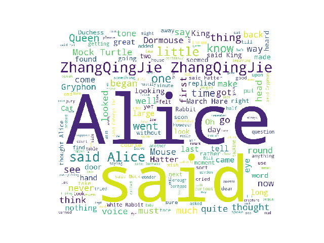

# worldcloud 学习笔记
##

## 2017-07-25 初次使用总结
 1. 在虚拟环境上首次使用时，出现错误，查看错位代码，发现是 D:\Python\Envs\bigdata\tcl 内缺失文件，可能是虚拟环境中缺少的吧！
 2. 随后去Python3的根目录下寻找 C:\Programs\Python\Python36-32\tcl, 然后copy到虚拟环境目录下，正常运行了！
 
 
### test01.py 快速生成词云，简单的读取文件，然后调用,示例如下：
[原文地址:Python词云 wordcloud十五分钟入门与进阶](https://zhuanlan.zhihu.com/p/27626809)

### test02.py 自定义字体颜色，通过修改wordcloud源码，重写内部的方，实现。源码主要来自wordcloud的github,你可以在github下载该例子
[原文地址:Python词云 wordcloud十五分钟入门与进阶](https://zhuanlan.zhihu.com/p/27626809)
### test03.py 使用背景图片的词云,
[原文地址](http://blog.csdn.net/tanzuozhev/article/details/50789226)

### test04.py 使用中文分词，指定背景图片
需要安装pip isntall jieba
[原文地址](http://blog.csdn.net/vivian_ll/article/details/68067574)
